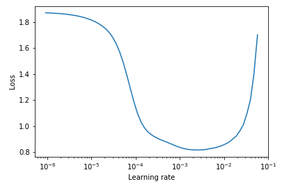

# Recommender system
Recommender system made in PyTorch with [learning rate finder](https://arxiv.org/abs/1506.01186) and [one cycle policy](https://arxiv.org/abs/1708.07120). 

## Datasets
[MovieLens dataset](https://grouplens.org/datasets/movielens/) with 100k ratings.  
[Book crossing dataset](http://www2.informatik.uni-freiburg.de/~cziegler/BX/).

## Training a model
<pre><code># Load modules for training
>>> from recsys.data import RecommenderDataset
>>> from recsys.model import Learner

# Create a PyTorch DataLoader from csv
>>> data = RecommenderDataset(dataset='ml-100k')

# Initiate learner class
>>> learn = Learner(n_epochs=5, data=data, y_range=(0.,5.5), weight_decay=5e-4)

# Use learning rate finder to figure a good learning rate
>>> learn.lr_find()
Stopping early, the loss has diverged
Learning rate search finished. See the graph with {Learner}.visualize.lr_finder()

# Plot the learning rate
>>> learn.visualize.lr_finder()
</code></pre>

<pre><code># Fit the model
learn.fit(learning_rate=5e-3</code>)</pre>

| Epoch | Train error | Validation error |
| ----- | ----------- | ---------------- |
| 1     | 1.369717    | 1.011008         |
| 2     | 0.921441    | 0.910910         |
| 3     | 0.857178    | 0.885235         |
| 4     | 0.830054    | 0.874283         |
| 5     | 0.801997    | 0.870345         |

## Project Organization
------------
    ├── LICENSE
    ├── README.md          
    ├── data
    │   ├── ml-100k        <-  MovieLens dataset.
    │   └── books          <-  Book crossing dataset.
    │
    ├── notebooks          <- Jupyter notebooks. Naming convention is a number (for ordering),
    │                         and a short `_` delimited description, e.g.
    │                         `1.0_initial_data_exploration`.
    │
    ├── requirements.txt   
    │
    ├── recsys             <- Source code for use in this project.
    │   │
    │   ├── data           <- Main Dataset class for pytorch loader
    │   │   └── _dataset_.py
    │   │
    │   ├── model          <- Class to train model, model itself 
    │   │   ├── _model.py
    │   │   └── _learner.py
    │   │
    │   └── visualization  <- Class to create exploratory and results oriented visualizations
    │       └── _visualizer.py
--------
